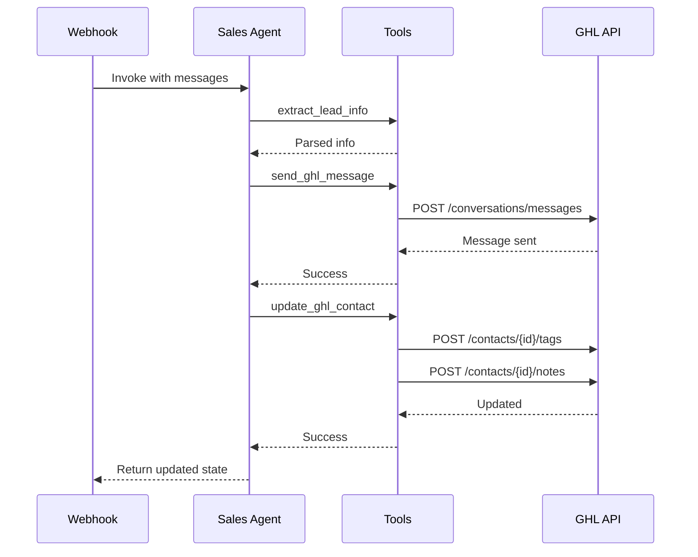
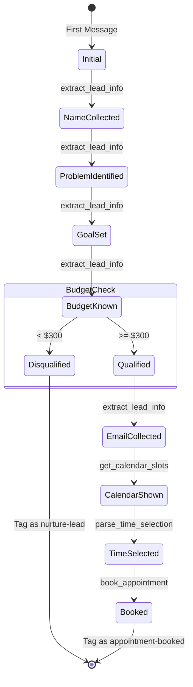

# Webhook Flow Debug Diagram

This comprehensive Mermaid diagram shows the complete flow from webhook receipt to GHL message delivery, including all decision points, error handling, and state management.

## Complete Webhook to GHL Flow

```mermaid
%%{init: {'theme': 'base', 'flowchart': {'htmlLabels': true, 'curve': 'basis'}}}%%
flowchart TB
    %% Entry Points
    Start@{ shape: circle, label: "Webhook<br/>Received" }
    
    %% Webhook Handler Components
    WebhookPayload@{ shape: doc, label: "Webhook Payload<br/>phone, message,<br/>contactId" }
    ValidatePayload@{ shape: diamond, label: "Validate<br/>Required Fields?" }
    HashMessage@{ shape: hex, label: "Create Message Hash<br/>MD5(contactId-message-phone)" }
    CheckDuplicate@{ shape: diamond, label: "Duplicate<br/>Message?" }
    
    %% Conversation Management
    FetchConversation@{ shape: subroutine, label: "Conversation Manager<br/>getConversationState()" }
    CheckConvoExists@{ shape: diamond, label: "Conversation<br/>Exists in GHL?" }
    CreateConversation@{ shape: rect, label: "Create Conversation<br/>ghlService.createConversation()" }
    UseMockConvoId@{ shape: rect, label: "Use Mock Conv ID<br/>conv_[contactId]" }
    FetchMessages@{ shape: cyl, label: "Fetch Message History<br/>from GHL API" }
    
    %% Lead Info Extraction
    ExtractLeadInfo@{ shape: hex, label: "Extract Current Lead Info<br/>from Conversation State" }
    BuildAgentMessages@{ shape: rect, label: "Build Message Array<br/>History + New Message" }
    
    %% Sales Agent Processing
    InvokeSalesAgent@{ shape: fr-rect, label: "Invoke Sales Agent<br/>with Messages & Context" }
    AgentProcessing@{ shape: procs, label: "Agent Processing<br/>- Extract Lead Info<br/>- Generate Response<br/>- Update Contact" }
    
    %% Tool Execution
    ExtractInfoTool@{ shape: trap-t, label: "extract_lead_info<br/>Parse customer message" }
    SendMessageTool@{ shape: trap-t, label: "send_ghl_message<br/>Send WhatsApp" }
    UpdateContactTool@{ shape: trap-t, label: "update_ghl_contact<br/>Add tags & notes" }
    GetCalendarTool@{ shape: trap-t, label: "get_calendar_slots<br/>Fetch available times" }
    ParseTimeTool@{ shape: trap-t, label: "parse_time_selection<br/>Parse user choice" }
    BookAppointmentTool@{ shape: trap-t, label: "book_appointment<br/>Create booking" }
    
    %% Decision Points
    CheckQualification@{ shape: diamond, label: "All Info<br/>Collected?" }
    CheckBudget@{ shape: diamond, label: "Budget >= $300?" }
    CheckEmail@{ shape: diamond, label: "Has Email?" }
    
    %% GHL Service Operations
    GHLAuth@{ shape: hex, label: "GHL Authentication<br/>Version: 2021-07-28" }
    SendWhatsApp@{ shape: rect, label: "Send WhatsApp<br/>type: 'WhatsApp'" }
    UpdateTags@{ shape: rect, label: "Update Contact Tags<br/>qualified-lead, etc" }
    AddNotes@{ shape: rect, label: "Add Conversation Notes<br/>with timestamp" }
    
    %% State Management
    ClearCache@{ shape: rect, label: "Clear Conversation Cache<br/>conversationManager.clearCache()" }
    ReturnState@{ shape: rect, label: "Return Updated State<br/>messages, leadInfo" }
    
    %% Error Handling
    ErrorHandler@{ shape: odd, label: "Error Handler<br/>Log & Return Message" }
    ErrorResponse@{ shape: doc, label: "Error Message<br/>'Hubo un error...'" }
    
    %% End States
    Success@{ shape: dbl-circ, label: "Success<br/>Message Sent" }
    Failed@{ shape: cross-circ, label: "Failed<br/>Error Logged" }
    
    %% Main Flow
    Start --> WebhookPayload
    WebhookPayload --> ValidatePayload
    
    ValidatePayload -->|Valid| HashMessage
    ValidatePayload -->|Invalid| ErrorHandler
    
    HashMessage --> CheckDuplicate
    CheckDuplicate -->|Yes| ReturnState
    CheckDuplicate -->|No| FetchConversation
    
    FetchConversation --> CheckConvoExists
    CheckConvoExists -->|Yes| FetchMessages
    CheckConvoExists -->|No| CreateConversation
    
    CreateConversation -->|Success| FetchMessages
    CreateConversation -->|Fail| UseMockConvoId
    UseMockConvoId --> FetchMessages
    
    FetchMessages --> ExtractLeadInfo
    ExtractLeadInfo --> BuildAgentMessages
    BuildAgentMessages --> InvokeSalesAgent
    
    %% Sales Agent Flow
    InvokeSalesAgent --> AgentProcessing
    AgentProcessing --> ExtractInfoTool
    
    ExtractInfoTool --> CheckQualification
    CheckQualification -->|Missing Info| SendMessageTool
    CheckQualification -->|All Info| CheckBudget
    
    CheckBudget -->|< $300| SendMessageTool
    CheckBudget -->|>= $300| CheckEmail
    
    CheckEmail -->|No| SendMessageTool
    CheckEmail -->|Yes| GetCalendarTool
    
    GetCalendarTool --> SendMessageTool
    SendMessageTool --> GHLAuth
    
    %% GHL Operations
    GHLAuth --> SendWhatsApp
    SendWhatsApp -->|Success| UpdateContactTool
    SendWhatsApp -->|Fail| ErrorHandler
    
    UpdateContactTool --> UpdateTags
    UpdateTags --> AddNotes
    AddNotes --> ClearCache
    
    ClearCache --> ReturnState
    ReturnState --> Success
    
    %% Error Paths
    ErrorHandler --> ErrorResponse
    ErrorResponse --> Failed
    
    %% Calendar Booking Flow
    SendMessageTool -->|Calendar Shown| ParseTimeTool
    ParseTimeTool --> BookAppointmentTool
    BookAppointmentTool --> UpdateContactTool

    %% Styling
    classDef entryPoint fill:#4CAF50,stroke:#388E3C,color:#fff
    classDef validation fill:#2196F3,stroke:#1976D2,color:#fff
    classDef process fill:#FF9800,stroke:#F57C00,color:#fff
    classDef decision fill:#9C27B0,stroke:#7B1FA2,color:#fff
    classDef tool fill:#00BCD4,stroke:#0097A7,color:#fff
    classDef ghl fill:#FFC107,stroke:#FFA000,color:#000
    classDef error fill:#F44336,stroke:#D32F2F,color:#fff
    classDef success fill:#4CAF50,stroke:#388E3C,color:#fff
    classDef storage fill:#607D8B,stroke:#455A64,color:#fff
    
    class Start entryPoint
    class ValidatePayload,CheckDuplicate,CheckConvoExists,CheckQualification,CheckBudget,CheckEmail decision
    class HashMessage,FetchConversation,ExtractLeadInfo,BuildAgentMessages,InvokeSalesAgent,AgentProcessing process
    class ExtractInfoTool,SendMessageTool,UpdateContactTool,GetCalendarTool,ParseTimeTool,BookAppointmentTool tool
    class GHLAuth,SendWhatsApp,UpdateTags,AddNotes ghl
    class ErrorHandler,ErrorResponse,Failed error
    class Success,ReturnState success
    class FetchMessages,CreateConversation storage
```



## Key Components for Debugging

### 1. **Webhook Entry** (webhookHandler.js)
- **Input Validation**: Check for phone, message, contactId
- **Deduplication**: MD5 hash to prevent duplicate processing
- **Error Handling**: Returns user-friendly error messages

### 2. **Conversation Management** (conversationManager.js)
- **Fetch State**: Gets conversation history from GHL
- **Cache**: 5-minute cache for performance
- **Fallback**: Uses mock conversation ID if GHL fails

### 3. **Sales Agent Processing** (salesAgent.js)
- **Tool Execution**: 6 Zod-validated tools
- **State Management**: Tracks lead info throughout conversation
- **Qualification Flow**: Enforces strict field collection

### 4. **GHL Integration** (ghlService.js)
- **Authentication**: Requires Version header '2021-07-28'
- **Message Sending**: Type must be 'WhatsApp'
- **Contact Updates**: Tags and notes for tracking

### 5. **Error States**
- Missing required fields → Error message
- GHL API failure → Mock conversation ID
- Tool execution failure → Error logged, conversation continues

## Debug Checkpoints


## Tool Execution Sequence



## State Flow Through Conversation



## Common Debug Scenarios

### Scenario 1: Message Not Sending
```
1. Check webhook payload has all fields
2. Verify GHL API key is valid
3. Check conversation ID exists
4. Verify WhatsApp type is correct
5. Check for rate limiting
```

### Scenario 2: Tool Not Executing
```
1. Check tool name matches exactly
2. Verify Zod schema validation
3. Check required parameters
4. Look for LLM timeout
5. Verify state has required context
```

### Scenario 3: Qualification Not Working
```
1. Check leadInfo state updates
2. Verify extract_lead_info parsing
3. Check field validation logic
4. Verify budget parsing (numeric)
5. Check email format validation
```

## Environment Variables Required

```
GHL_API_KEY=xxx
GHL_LOCATION_ID=xxx
GHL_CALENDAR_ID=xxx
OPENAI_API_KEY=xxx
LANGCHAIN_API_KEY=xxx (optional)
LANGCHAIN_TRACING_V2=true (optional)
```

## Test Commands

```bash
# Test webhook validation
node tests/test-webhook-validation.js

# Test full conversation flow
node tests/test-conversation-flow.js

# Test with debug output
DEBUG=true node tests/test-full-flow.js

# Test specific component
node tests/test-components.js
```