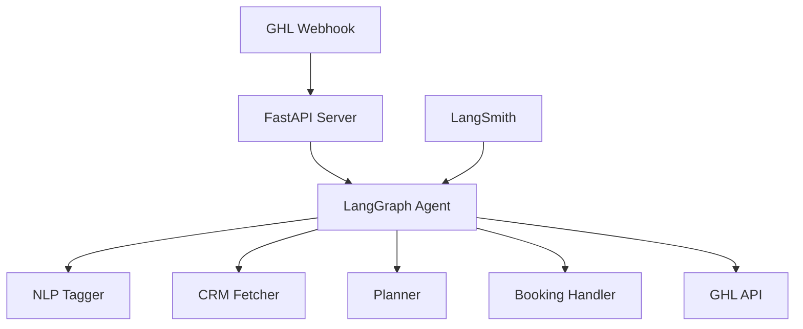

# LangGraph Agent Deployment Guide

## Overview

This guide covers deploying your GHL (Go High Level) agent to LangSmith LangGraph Cloud with full tracing capabilities.

## Current Status

✅ **Local Development Environment**
- LangGraph API: http://localhost:8123
- Webhook Server: http://127.0.0.1:8000
- LangSmith Tracing: Enabled (project: `ghl-agency-prod`)

✅ **Agent Features**
- Multi-language NLP (Spanish/English)
- Intent classification (book, qualify, support, other)
- GHL CRM integration
- Smart routing and planning
- Booking slot management

## Architecture



## Deployment Steps

### 1. Prepare for Cloud Deployment

Update `agent/langgraph.json` for production:

```json
{
  "dependencies": ["."],
  "graphs": {
    "ghl-agent": "./app/compiled.py:graph"
  },
  "env": {
    "LANGSMITH_API_KEY": "",
    "LANGCHAIN_TRACING_V2": "true",
    "LANGCHAIN_PROJECT": "ghl-agency-prod",
    "GHL_API_KEY": "",
    "GHL_LOCATION_ID": "",
    "GHL_CALENDAR_ID": "",
    "OPENAI_API_KEY": "",
    "MODEL_CLASSIFY": "gpt-4o-mini",
    "MODEL_RESPOND": "gpt-4o"
  },
  "python_version": "3.11"
}
```

### 2. Deploy to LangGraph Cloud

```bash
# Install LangGraph CLI
pip install -U langgraph-cli

# Login to LangSmith
langgraph auth login

# Deploy from agent directory
cd agent
langgraph deploy --name "ghl-sales-agent"
```

### 3. Monitor in LangSmith

1. Go to https://smith.langchain.com
2. Navigate to your project: `ghl-agency-prod`
3. View traces under "Runs" tab
4. Monitor performance metrics

### 4. Production Webhook Integration

Once deployed, you'll get a production URL like:
```
https://api.langchain.com/v1/graphs/YOUR_DEPLOYMENT_ID
```

Update your GHL webhook to point to:
```
https://api.langchain.com/v1/graphs/YOUR_DEPLOYMENT_ID/webhooks/ghl
```

## Testing the Deployment

### Test via API

```bash
# Test the deployed agent
curl -X POST https://api.langchain.com/v1/graphs/YOUR_DEPLOYMENT_ID/runs/wait \
  -H "X-API-Key: YOUR_LANGSMITH_API_KEY" \
  -H "Content-Type: application/json" \
  -d '{
    "assistant_id": "ghl-agent",
    "input": {
      "contact_id": "test-123",
      "latest_text": "I want to book an appointment",
      "channel": "sms"
    },
    "config": {
      "configurable": {"thread_id": "test-123"}
    }
  }'
```

### View Traces

1. Open LangSmith: https://smith.langchain.com/projects
2. Select your project: `ghl-agency-prod`
3. View real-time traces showing:
   - Input/output for each node
   - Execution time
   - Token usage
   - Error tracking

## Environment Variables

Set these in LangGraph Cloud dashboard:

- `LANGSMITH_API_KEY`: Your LangSmith API key
- `GHL_API_KEY`: Go High Level API key
- `GHL_LOCATION_ID`: Your GHL location ID
- `GHL_CALENDAR_ID`: Calendar for bookings
- `OPENAI_API_KEY`: For GPT-4 models
- `MODEL_CLASSIFY`: Model for classification (gpt-4o-mini)
- `MODEL_RESPOND`: Model for responses (gpt-4o)

## Monitoring & Debugging

### LangSmith Features

1. **Trace View**: See complete execution flow
2. **Feedback**: Add human feedback to runs
3. **Datasets**: Create test datasets
4. **Experiments**: A/B test different prompts
5. **Metrics**: Track latency, costs, success rates

### Example Trace View

```
Run: book_appointment_spanish
├── nlp_tagger (0.8s)
│   ├── Input: {"latest_text": "Quiero agendar..."}
│   └── Output: {"language": "es", "intent": "book"}
├── crm_fetcher (0.3s)
│   └── Output: {"tags": [], "stage": null}
├── planner (0.5s)
│   └── Output: {"next_action": "booking"}
└── booking_handler (1.2s)
    └── Output: {"selected_slot": "2025-08-09T15:00:00"}
```

## Advanced Features

### 1. Custom Evaluators

Create evaluators in LangSmith:

```python
from langsmith import Client

client = Client()

# Create custom evaluator
def intent_accuracy(run, example):
    predicted = run.outputs.get("nlp", {}).get("intent")
    expected = example.outputs.get("expected_intent")
    return {"score": 1 if predicted == expected else 0}

# Add to your project
client.create_evaluator(
    name="intent_accuracy",
    evaluator=intent_accuracy,
    project_name="ghl-agency-prod"
)
```

### 2. Alerts

Set up alerts for:
- High latency (>3s)
- Failed runs
- Low confidence scores
- Unexpected intents

### 3. Version Control

Each deployment creates a version:

```bash
# List deployments
langgraph deployments list

# Rollback to previous version
langgraph deployments rollback DEPLOYMENT_ID VERSION_ID
```

## Troubleshooting

### Common Issues

1. **Missing environment variables**
   - Check LangGraph Cloud dashboard
   - Verify all required vars are set

2. **GHL API errors**
   - Verify API key permissions
   - Check location ID access

3. **Trace not showing**
   - Ensure LANGCHAIN_TRACING_V2=true
   - Check LANGSMITH_API_KEY is valid

### Debug Mode

Enable verbose logging:

```python
# In app/graph.py
import logging
logging.basicConfig(level=logging.DEBUG)
```

## Cost Optimization

1. Use `gpt-4o-mini` for classification
2. Cache CRM data when possible
3. Implement rate limiting
4. Monitor token usage in LangSmith

## Security Best Practices

1. Rotate API keys regularly
2. Use environment variables (never hardcode)
3. Implement webhook signature validation
4. Enable CORS restrictions
5. Use HTTPS for all endpoints

## Next Steps

1. Set up staging environment
2. Create test suites in LangSmith
3. Implement A/B testing for prompts
4. Add custom metrics tracking
5. Set up automated alerts

---

For support: https://docs.langchain.com/docs/langgraph-cloud
